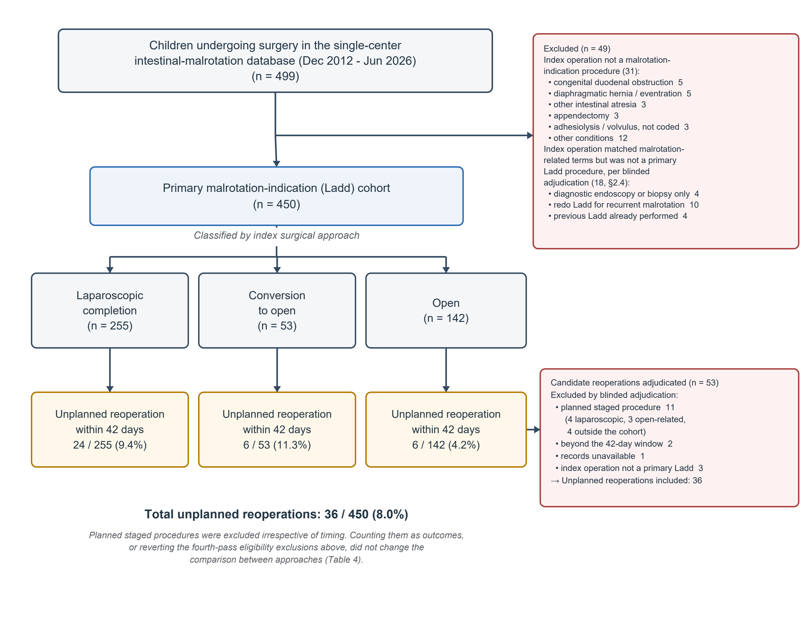

## Title Page

**Article type:** Original Article (retrospective cohort study)

**Title:** Cause and Operative Mechanism of Early Unplanned Reoperation After Primary Ladd Procedure: A Blinded Adjudication Study of 450 Children

**Short title:** Early reoperation after Ladd procedure

**Authors:** Jun Shu, MD; Kai Zheng, MD; Hongqiang Bian, MD; Jun Yang, MD; Xin Wang, MD\*

**Affiliation (all authors):** Department of General Surgery, Wuhan Children’s Hospital (Wuhan Maternal and Child Healthcare Hospital), Tongji Medical College, Huazhong University of Science & Technology, Wuhan 430016, Hubei Province, China

Jun Shu and Kai Zheng contributed equally to this work and are co-first authors.

**\*Corresponding author:** Xin Wang, MD, Department of General Surgery, Wuhan Children’s Hospital (Wuhan Maternal and Child Healthcare Hospital), Tongji Medical College, Huazhong University of Science & Technology, Wuhan 430016, Hubei Province, China. Email: wangxin@zgwhfe.com. Tel: +86 18995563848.

**Word count:** Abstract 194 · Main text 4201
**Tables:** 4 · **Figures:** 2 · **Supplementary material:** 5 tables, 2 figures
**References:** 25

**Funding:** This research did not receive any specific grant from funding agencies in the public, commercial, or not-for-profit sectors.

<!--pagebreak-->
## Structured Abstract

**Purpose:** To determine the incidence, adjudicated cause, and operative mechanism of early unplanned reoperation after primary Ladd procedure, and whether cause differs by approach.

**Methods:** Single-center retrospective cohort of 450 children after primary Ladd operation (2012–2026); the outcome was unplanned reoperation within 42 days. Eligibility, index approach, cause, and mechanism were adjudicated in four blinded passes (κ 0.82–1.00). Cause-specific rates were compared with Holm-corrected Fisher exact tests; age stratification was post hoc.

**Results:** Reoperation occurred in 36/450 (8.0%), median 14.5 days. Persistent duodenal obstruction was the commonest cause (12/36, 33.3%), following 12/255 (4.7%) laparoscopic completions and no open-related operation (risk difference +4.7%, 95% CI 1.9–8.0; Holm p=0.010; odds ratio not estimable). On blinded re-review, 9 of these 12 were periduodenal adhesion and 3 a technical deficiency of the index procedure—all three neonatal and laparoscopic. Cases were bimodal by age; among neonates the risk difference was 4.2% (95% CI 1.0–8.9; 6/142 vs. 0/163). Overall rates did not differ (9.4% vs. 6.2%; risk difference +3.3%, 95% CI −2.0 to +8.2).

**Conclusion:** The reason for early reoperation differed by approach and age, while overall rates did not detectably differ. Duodenal mobilization during neonatal laparoscopic Ladd warrants deliberate intraoperative confirmation and prospective study.

**Keywords:** intestinal malrotation; Ladd procedure; laparoscopy; reoperation; duodenal obstruction; neonate

<!--pagebreak-->
## 1. Introduction

The Ladd procedure is the standard operation for intestinal malrotation, performed both open and laparoscopically [1,2,3]. Whether laparoscopy carries a higher risk of recurrent volvulus and a lower risk of adhesive obstruction has been debated for two decades, and the most recent series and meta-analyses still disagree [3,4,5,6]. Most reported morbidity, however, concerns events beyond the first weeks [7,8,9]; how often children undergo unplanned reoperation in the first postoperative weeks, when, and for what cause is far less clear.

The distinction between *how often* and *why* matters: a crude comparison of reoperation rates conflates mechanisms with entirely different implications. Obstruction at the duodenal level points back to the index operation—the completeness of duodenal mobilization and division of Ladd bands, adhesion forming around the mobilized duodenum, or an unrecognized intrinsic lesion such as a duodenal web [10]. Reoperation for necrosis, perforation, or anastomotic failure instead reflects the severity of the disease that first brought the child to theater. A pooled rate can therefore conceal, or create, an apparent effect of approach.

Approach is chosen non-randomly, and two selection forces act in opposite directions. The sickest children—neonates with volvulus and compromised bowel—are preferentially operated open, so any severity-driven complication is over-represented in the open arm. Age acts the other way: older children, operated electively for chronic or intermittent symptoms, are preferentially operated laparoscopically [2,9,11]. Propensity-score analyses have either been confined to neonates and infants [12] or treated age as one covariate among many; conversion, itself predicted by age and severity, blurs the comparison further [13]—a simplification our own primary comparison shares, since it too pools conversions with open surgery (§2.3, §3.4).

Recent work has begun to define anatomical landmarks confirming that each step of a neonatal laparoscopic Ladd has been completed [14]; it specifies what should be verified during the operation, not what is found at reoperation when verification fails. We therefore (i) determined the incidence and timing of early unplanned reoperation in 450 children, (ii) adjudicated the cause of every reoperation under blinding to index approach, (iii) re-read the operative findings of every duodenal reoperation to assign a mechanism—technical deficiency versus postoperative adhesion—under separate blinding, and (iv) compared cause-specific rates between approaches. The age stratification that shapes our principal conclusion was not part of this plan; it was prompted by the observed age distribution of the duodenal cases and is reported as post hoc throughout (§2.5). Recurrent volvulus and non-duodenal adhesive obstruction were each too rare in our cohort to inform the debate above, so our findings speak only to persistent duodenal obstruction, the commonest cause of early reoperation here.

## 2. Materials and Methods

### 2.1 Design and setting
Single-center retrospective cohort study at Wuhan Children’s Hospital, a tertiary hospital, reported per STROBE [15], covering December 2012 to June 2026. The study was not registered in a public study registry. The institutional ethics committee approved the study (no. 2026R018-E01) and waived informed consent.

### 2.2 Participants
The institutional intestinal-malrotation database contained 499 children with an operative record. The index operation was the earliest primary Ladd-type operation recorded, identified by searching the Chinese-language procedure name and coded diagnosis for five terms denoting the Ladd procedure, derotation, intestinal rotation, the midgut, and malrotation (Supplementary Table S2). Applying that same rule to each child's earliest recorded operation excluded 31 children whose earliest operation matched none of the five terms—most often a diaphragmatic hernia repair, another intestinal atresia, or an appendectomy that preceded any malrotation-related admission—leaving 468 (itemized in Fig. 1). Because the earliest recorded operation among the remainder is not always the first Ladd procedure, every record whose earliest operation was a diagnostic endoscopy or biopsy, or whose coded diagnosis indicated a previous repair, was adjudicated case by case (§2.4); 19 were reviewed and 18 excluded. Separately, in 3 children whose earliest recorded operation was a preliminary procedure on the same admission, the index date was corrected to the nearby operation that was unambiguously the primary Ladd; only one of these three coincided with the 19-child review, and that child was excluded rather than retained. No child was excluded for age (oldest 14.2 years). The final cohort was 450 children (Fig. 1); no a priori sample-size calculation was performed.

**Fig. 1** Participant flow. Of 499 children with an operative record in the single-center malrotation database (December 2012–June 2026), 450 had a primary Ladd operation after blinded adjudication of every questionable index record (§2.4). The cohort comprised 255 laparoscopic completions, 53 conversions to open, and 142 open procedures, with 24, 6, and 6 unplanned reoperations respectively (36/450, 8.0%). The right-hand panel shows the outcome adjudication of 53 candidate reoperations. Planned staged procedures were excluded irrespective of timing; counting them as outcomes did not change the comparison between approaches (Table 3)

### 2.3 Variables and definitions
*Exposure (index approach)* was *laparoscopic completion*, *conversion to open*, or *open*, assigned for all 450 children by a keyword rule applied to the procedure name and operative narrative, as was index bowel necrosis; both rules are given verbatim in Supplementary Table S2 and were validated against blinded reviewer consensus (§2.4). “Open-related” denotes conversion plus open.

*The primary outcome* was the first unplanned reoperation within 42 days of the index operation; only the first was counted. Planned staged procedures (elective stoma closure, planned re-look) were excluded by adjudication irrespective of timing. Reoperations were identified from the institutional registry, which captures readmissions to this hospital; median stay after the index operation was 12 days (IQR 9–16). Children who did not return within the window were treated as event-free.

*Cause* was adjudicated as a single choice among six categories: (1) persistent duodenal obstruction, defined as obstruction at the duodenal level with no intrinsic duodenal lesion found; (2) bowel necrosis, perforation, or anastomotic complication; (3) adhesive obstruction not at the duodenal level; (4) missed associated anomaly, i.e. a coexisting gastrointestinal malformation first identified or confirmed at reoperation; (5) recurrent volvulus requiring redo-Ladd; (6) other. Categories (1)–(3), (5) and (6) were prespecified; category (4) was separated from category (1) after adjudication (§2.4). Prespecified priority rules assigned a reoperation revealing an intrinsic anomaly to category 4, a duodenal anastomosis with adhesiolysis to category 1, and recurrent volvulus with adhesiolysis to category 5.

*The competing event* was death within the same window. Because a child discharged against medical advice might be reoperated elsewhere, all 24 such children were traced by telephone: 18 had died, 4 reported no operation elsewhere, and 2 could not be contacted. Only confirmed deaths are treated as competing events; the 2 untraced children are censored at discharge.

*Age* was taken from the earliest admission record and analyzed both continuously and in three bands—neonate (<28 days), 28 days to 1 year, and ≥1 year.

*Postoperative imaging.* For children reoperated for persistent duodenal obstruction, every contrast study between the index operation and the reoperation was retrieved and classified by whether the report described impaired duodenal transit.

### 2.4 Blinded adjudication
Adjudication was performed in four independent passes designed to keep eligibility, exposure, outcome, and mechanism apart; the full protocol and every agreement statistic are given in Supplementary Tables S1 and S4.

In the **first pass**, two reviewers independently read operative narratives with all approach-identifying wording masked and assigned the cause of reoperation and the presence of an associated anomaly. In the **second pass**, index approach and severity were adjudicated from complete index operative notes for 132 children—the 38 reoperations then adjudicated, mixed with 94 non-reoperated children drawn at random—so reviewers did not know who had been reoperated; this validated the keyword rules of §2.3, which assigned exposure for the remainder. In the **third pass**, a second reviewer independently assigned the mechanism of each persistent duodenal obstruction (technical deficiency / intrinsic lesion / postoperative periduodenal adhesion / indeterminate) from the reoperation narratives, with abdominal-access wording masked, case order randomized, and no access to age or index approach. In the **fourth pass**, two reviewers independently judged whether each of 19 questionable index records was a primary Ladd procedure, with later records withheld so that reoperation status could not influence eligibility.

Agreement was quantified with Cohen’s κ and, for rare binary outcomes, the prevalence-adjusted bias-adjusted κ (PABAK) [16]: associated-anomaly and prior-diagnosis fields κ=1.00, index approach κ=0.82, cause κ=0.90 (95% CI 0.81–0.99), mechanism κ=1.00 (all 12 cases; Wilson 95% CI 75.7–100%), eligibility κ=0.844. The category *missed associated anomaly* was separated from *persistent duodenal obstruction* after adjudication without re-reading any record: membership is a deterministic function of two fields each reviewer had already scored under blinding (Supplementary Table S4).

Records for four children were absent from the research extract and were retrieved before analysis; in one, the missing index note showed conversion to open, which would otherwise have been misclassified.

### 2.5 Statistical analysis
Cause-specific and overall rates were compared with Fisher exact test, using Wilson 95% confidence intervals for proportions, conditional exact (Cornfield) intervals for odds ratios, and Newcombe intervals for risk differences [17]. Holm’s step-down correction [18] was applied across the six cause-specific comparisons and separately across the age-stratified ones; both family definitions are reported because the choice changes the conclusion (§3.6). Cumulative incidence functions were estimated by the Aalen–Johansen method [19] treating death as a competing event, and cause-specific Cox regression was fitted censoring at the competing event. Because death removes a child from the population able to be reoperated, cumulative incidence is reported as an Aalen–Johansen estimate rather than as the complement of a Kaplan–Meier curve, which would overstate the incidence of reoperation in the arm where the competing event is concentrated. Firth penalized-likelihood logistic regression [20] provided bias-corrected adjusted odds ratios. Secondary analyses—Mantel–Haenszel pooling, intention-to-treat regrouping of conversions, era comparison, and alternative outcome and cohort definitions—are listed in Supplementary Table S5 and reported in §3.4. E-values were computed for the neonatal association [21].

The age-stratified analysis was **not prespecified**; it was prompted by the bimodal ages of the 12 duodenal-obstruction reoperations and by the recognition that age predicts both outcome and approach. We report it alongside the unstratified estimate, not in place of it; no formal age-by-approach interaction test was performed (§4). Because the principal comparison is null, we report the risk difference with its confidence interval and the study's power, so that it is read as a bounded absence of evidence rather than as equivalence.

Sex was analysed as a reporting variable throughout: cohort composition, the primary outcome, and the principal cause-specific comparison are each reported separately for boys and girls (§3.8). Sex, age, index operation date, and index approach were complete for all 450 children. Text used for keyword ascertainment of associated anomalies was unavailable for 6/450 (1.3%); these were imputed as anomaly-absent, biasing anomaly-related associations toward the null. Analyses used Python 3.13 (NumPy 2.5, SciPy 1.18, pandas 2.3, lifelines 0.30).

## 3. Results

### 3.1 Cohort
Of 499 children, 450 formed the cohort: 255 laparoscopic completion, 53 conversion to open, and 142 open (Fig. 1). The groups differed on two axes (Table 1). By severity, the open-related group had far more index bowel necrosis (25.1% vs. 2.4%). By age, it was younger (median 0.1 vs. 0.6 months) and predominantly neonatal (83.6% vs. 55.7%), whereas of the 84 children operated at ≥1 year, 71 (85%) underwent laparoscopy. Only sex was balanced.

**Table 1.** Baseline characteristics by index surgical approach.

| Characteristic | Overall (n=450) | Laparoscopic completion (n=255) | Open-related (n=195) | SMD\* |
|---|---|---|---|---|
| Male sex, n (%) | 344 (76.4) | 196 (76.9) | 148 (75.9) | +0.02 |
| Age at index operation, months, median (IQR) | 0.2 (0.1–2.0) | 0.6 (0.2–22.0) | 0.1 (0.1–0.5) | **+0.76**^a^ |
| — Neonate (<28 days), n (%) | 305 (67.8) | 142 (55.7) | 163 (83.6) | **−0.64** |
| — 28 days – 1 year, n (%) | 61 (13.6) | 42 (16.5) | 19 (9.7) | **+0.20** |
| — ≥1 year, n (%) | 84 (18.7) | 71 (27.8) | 13 (6.7) | **+0.58** |
| Bowel necrosis at index operation, n (%) | 55 (12.2) | 6 (2.4) | 49 (25.1) | **−0.70** |
| Any associated structural anomaly, n (%) | 74 (16.4) | 28 (11.0) | 46 (23.6) | **−0.34** |
| — Intrinsic duodenal anomaly (atresia/stenosis/annular pancreas) | 20 (4.4) | 6 (2.4) | 14 (7.2) | **−0.23** |
| — Other GI / abdominal-wall anomaly | 42 (9.3) | 13 (5.1) | 29 (14.9) | **−0.33** |
| — Structural congenital heart disease | 18 (4.0) | 9 (3.5) | 9 (4.6) | −0.05 |
| — Heterotaxy / situs anomaly | 1 (0.2) | 1 (0.4) | 0 (0.0) | +0.09 |
| — Chromosomal / syndromic | 1 (0.2) | 1 (0.4) | 0 (0.0) | +0.09 |

\* Standardized mean difference (laparoscopic completion minus open-related); |SMD| ≥ 0.10 in bold [25]. We report SMDs rather than p values because the two arms are not samples from a common population; the SMD quantifies the size of the imbalance the analysis must contend with, independently of sample size. The two groups differ on two separate axes: *severity* (necrosis, associated anomalies — higher in the open-related arm) and *age* (neonates concentrated in the open-related arm, children ≥1 year in the laparoscopic arm). These push any crude comparison in opposite directions, which is why the cause-specific analysis is presented stratified by age (Table 4). Necrosis is shown as a marker of index-operation severity, not a baseline demographic. Isolated patent foramen ovale, patent ductus arteriosus, and secundum atrial septal defect were treated as physiological in neonates. Diagnostic text was unavailable for 6/450 (1.3%), imputed as anomaly-absent, which biases anomaly-related associations toward the null. Anomaly coding draws on discharge and pathology text from every admission, including any reoperation, so these rows describe anomalies ever recorded rather than anomalies known before the index operation.
^a^ Age is strongly right-skewed, so its SMD is computed on the log(days + 1) scale; the median and IQR are shown untransformed, in months.

### 3.2 Incidence and timing
Unplanned reoperation occurred in 36/450 children (8.0%, 95% CI 5.8–10.9). Of 53 candidate reoperations adjudicated, 11 were excluded as planned staged procedures, 2 as beyond the window, 1 for missing records, and 3 because the index operation was not a primary Ladd (Fig. 1; Supplementary Table S3). Reoperation clustered in the second and third postoperative weeks: median 14.5 days (IQR 10–19), with 67% (24/36) on days 8–21.

### 3.3 Causes of reoperation
Persistent duodenal obstruction with no intrinsic lesion was the commonest cause (12/36, 33.3%), followed by necrosis, perforation, or anastomotic complication (8/36), non-duodenal adhesive obstruction (5/36), other complications (5/36), a missed associated anomaly (4/36), and recurrent volvulus (2/36). Obstructive causes together accounted for 19/36 (52.8%) (Table 2).

**Table 2.** Cause of unplanned reoperation, overall and by index approach.

| Cause (adjudicated, single choice) | Overall (n=36) | Lap (n=24) | Open-related (n=12) | Rate, lap vs. open-related | OR (exact 95% CI) | p\* | Holm-adjusted p |
|---|---|---|---|---|---|---|---|
| 1. Persistent duodenal obstruction (no intrinsic lesion) | 12 (33.3%) | 12 | 0 | **4.7% vs. 0.0%** | **NE (≥2.19)** | **0.0016** | **0.010** |
| 2. Necrosis / perforation / anastomotic complication | 8 (22.2%) | 2 | 6 | 0.8% vs. 3.1% | 0.25 (0.02–1.4) | 0.0821 | 0.411 |
| 3. Adhesive obstruction (non-duodenal) | 5 (13.9%) | 4 | 1 | 1.6% vs. 0.5% | 3.09 (0.30–153.0) | 0.3944 | 1.000 |
| 4. Missed associated anomaly^a^ | 4 (11.1%) | 3 | 1 | 1.2% vs. 0.5% | 2.31 (0.18–121.9) | 0.6367 | 1.000 |
| 5. Recurrent volvulus / redo-Ladd | 2 (5.6%) | 2 | 0 | 0.8% vs. 0.0% | NE (≥0.14) | 0.5078 | 1.000 |
| 6. Other^b^ | 5 (13.9%) | 1 | 4 | 0.4% vs. 2.1% | 0.19 (0.00–1.9) | 0.1713 | 0.685 |
| **Obstructive causes combined (1+3+5)** | **19 (52.8%)** | 18 | 1 | 7.1% vs. 0.5% | — | — | — |

\* Fisher exact test on rates with the full cohort as denominator (255 laparoscopic, 195 open-related); conditional exact (Cornfield) 95% confidence intervals; Holm's step-down correction across the six cause-specific comparisons. **NE, not estimable**: no open-related child had a persistent duodenal obstruction, so only the one-sided lower bound is informative and the risk difference (+4.7 percentage points, 95% CI 1.9 to 8.0) is the interpretable measure. Conditional on having been reoperated, persistent duodenal obstruction accounted for 12/24 laparoscopic versus 0/12 open-related reoperations; this conditions on a consequence of the exposure and describes case-mix rather than effect.
^a^ Coexisting malformation first identified or confirmed at reoperation: duodenal membrane 3, multiple jejunal atresia 1.
^b^ Wound dehiscence 2, stress-ulcer bleeding 2, stoma prolapse 1.

*Mechanism of the 12 persistent duodenal obstructions* (operative-note re-review, §3.7): postoperative periduodenal adhesion 9 (all laparoscopic; 3 neonates and 6 children ≥1 year), technical deficiency of the index procedure 3 (all laparoscopic, all neonates).

### 3.4 Overall rate by index approach
The overall reoperation rate was 9.4% (24/255; 95% CI 6.4–13.6) after laparoscopic completion, 11.3% (6/53; 5.3–22.6) after conversion, and 4.2% (6/142; 2.0–8.9) after open surgery. Conversions had the highest rate (11.3% vs. 4.2%, p=0.091, post hoc), so the comparator is not internally homogeneous. We did not detect a difference between laparoscopic completion and open-related surgery (9.4% vs. 6.2%; OR 1.58, exact 95% CI 0.74–3.6, p=0.22) (Table 3). This is a bounded null rather than equivalence: the risk difference was +3.3 percentage points (95% CI −2.0 to +8.2), an interval still compatible with a clinically important excess.

**Table 3.** Overall unplanned reoperation rate by index approach, with adjusted and sensitivity analyses.

| Analysis | Estimate | 95% CI | p |
|---|---|---|---|
| Laparoscopic completion | 24/255 (9.4%) | 6.4–13.6 | — |
| Conversion to open | 6/53 (11.3%) | 5.3–22.6 | — |
| Open | 6/142 (4.2%) | 2.0–8.9 | — |
| **All children** | 36/450 (8.0%) | 5.8–10.9 | — |
| Crude, laparoscopic vs. open-related | OR 1.58 | 0.74–3.6 (exact) | 0.224 |
| *Heterogeneity within the comparator:* conversion vs. open | 11.3% vs. 4.2% | 0.73–11.3 (exact) | 0.091 |
| Competing-risk cumulative incidence at 42 days | 9.4% vs. 6.2% | — | — |
| Cause-specific Cox (competing event censored) | HR 1.41 | 0.71–2.82 | 0.331 |
| Firth, unadjusted | OR 1.55 | 0.76–3.16 | 0.215 |
| Firth + neonate (<28 days) + index necrosis | OR 1.64 | 0.75–3.60 | 0.209 |
| Firth + age band + index necrosis | OR 1.59 | 0.72–3.49 | 0.246 |
| Mantel–Haenszel, stratified by age band | OR 1.54 | 0.74–3.24 | — |
| Intention-to-treat (conversions grouped with laparoscopic) | OR 2.45 | 0.97–7.4 (exact) | 0.060 |
| Era effect within laparoscopic group (≤2017 vs. >2017) | 10.0% vs. 8.8% | — | 0.832 |
| Counting planned staged reoperations as outcomes | OR 1.48 (28/255 vs. 15/195) | 0.74–3.1 (exact) | 0.261 |
| Reverting the fourth-pass eligibility exclusions (n=468) | OR 1.47 (25/260 vs. 14/208) | 0.71–3.2 (exact) | 0.314 |
| Firth + index year | OR 1.49 | 0.73–3.06 | 0.269 |

Wilson 95% confidence intervals for proportions, Newcombe for the risk difference, conditional exact (Cornfield) for odds ratios. The competing event occurred only after open-related surgery (16 deaths versus none after laparoscopic completion), so its cause-specific hazard ratio is not estimable. The comparator is not internally homogeneous (row 6), and the intention-to-treat row moves exactly that subgroup. Firth p values are from the penalized likelihood-ratio test with the coefficient of interest constrained to zero within the full design matrix; its 95% confidence intervals are Wald-type and under (quasi-)complete separation need not agree with that p value. The era split (2017) is the median calendar year of the laparoscopic group's own index operations, fixed by that definition rather than chosen from the outcome data; index year enters the Firth model as a continuous, standardized (z-score) covariate. The consensus-adjudicated subsample comprises the members of that pool who remain in the cohort—35 reoperations plus 89 non-reoperated children sampled at random, 124 in all; because every case and a random fraction of non-cases were included, odds ratios are estimable from it but rates are not. Within it the keyword rule and the blinded reviewer consensus disagreed on 5 of 124 children (4.0%). Every analysis of the overall rate is null, but against the observed open-related rate of 6.2% the study had 19% power to detect an odds ratio of 1.5 and 51% for 2.0, so this is a bounded absence of evidence, not evidence of equivalence.

*Adjusted models for persistent duodenal obstruction* (Firth penalized likelihood, laparoscopic vs. open-related):

| Model | OR | 95% CI | p |
|---|---|---|---|
| Unadjusted | 20.07 | 1.17–343.61 | 0.001 |
| + neonate (<28 days) | 18.92 | 1.12–318.53 | 0.002 |
| + neonate + index necrosis | 16.22 | 1.18–222.70 | 0.006 |
| + log(age in days) + index necrosis | 12.62 | 0.90–177.55 | 0.020 |
| + age band + index necrosis | 14.88 | 1.11–199.78 | 0.009 |

Adjustment for age attenuates the estimate (from OR 20.1 unadjusted to 12.6–18.9 adjusted), because age predicts both the outcome and the choice of approach. These are penalized estimates under complete separation—no open-related child had this outcome—so they should be read as evidence of direction, not as effect sizes. With only 12 events, the most heavily adjusted model (age band + index necrosis, 4 predictor parameters) has an events-per-variable ratio of 3, well below the conventional EPV≥10 guideline; Firth penalization mitigates but cannot fully resolve the resulting instability. Consistent with that instability, the confidence intervals span more than two orders of magnitude, and one of them includes unity despite a penalized likelihood-ratio p below 0.05. The age-stratified analysis in Table 4 shows where the association actually lies.

Every other analysis of the overall rate was concordant: competing-risk cumulative incidence 9.4% versus 6.2%, and the Cox, Firth, Mantel–Haenszel, planned-as-outcome and eligibility-reversion estimates all between 1.41 and 1.64, every interval including 1 (Table 3; Supplementary Figure S1). The proportional-hazards assumption held (p=0.15) and no era effect was detected. The intention-to-treat regrouping was the largest estimate but did not reach significance (OR 2.45, 0.97–7.4, p=0.060); reclassifying exposure by blinded consensus in that subsample gave OR 2.03 (0.84–5.17).

### 3.5 Cause-specific rates by index approach
Although the overall rates were similar, the causes were not (Table 2; Supplementary Figure S2). Persistent duodenal obstruction occurred in 12/255 (4.7%) after laparoscopic completion and in no open-related child (risk difference +4.7 percentage points, 95% CI 1.9 to 8.0; Holm-adjusted p=0.010)—the only cause-specific comparison to survive correction for multiplicity. With one cell empty the odds ratio is not estimable, and the risk difference is the interpretable measure. The pattern reversed for severity-driven complications: necrosis, perforation, or anastomotic complication occurred in 0.8% versus 3.1% (OR 0.25, 95% CI 0.02–1.4), and “other” complications likewise favored laparoscopy. A missed associated anomaly accounted for four further reoperations (1.2% vs. 0.5%).

Every death within the window followed open-related surgery (16 versus none after laparoscopic completion), so its hazard ratio is not estimable; the arms comprised populations at substantially different risk (Table 1).

### 3.6 Age stratification of the duodenal-obstruction signal
The ages at which the 12 duodenal obstructions occurred fell into two separated clusters: six children were operated at 4–11 days and six at 6.6–13.1 years, with no case between 11 days and 6.6 years (Fig. 2a). With 12 events we did not test this separation formally; it describes the observed distribution rather than establishing two populations.

**Fig. 2** Persistent duodenal obstruction, by age at the index operation. **(a)** Every one of the 12 cases plotted by age on a logarithmic scale, colored by index approach. The distribution is bimodal—six neonates operated at 4–11 days and six children operated at 6.6–13.1 years—with no case between 11 days and 6.6 years. **(b)** Cause-specific rate within each age stratum, using all children of that age and approach as the denominator; numerals are events over denominator. No open-related child had this outcome in any stratum. Among neonates, where the two arms are of comparable size, the risk difference is 4.2 percentage points (6/142 vs. 0/163, 95% CI 1.0–8.9); this is also the stratum in which all three technically deficient index operations were found. Beyond one year the rate after laparoscopy is 8.5% and every case was adhesive, but only 13 children of that age were operated open, so the stratum contributes no evidence about approach

Among neonates, persistent duodenal obstruction followed 6/142 (4.2%) laparoscopic completions and 0/163 (0%) open-related operations (p=0.0096; risk difference 4.2 percentage points, 95% CI 1.0–8.9; number needed to harm 24) (Table 4, Fig. 2b). The comparison held under formal competing-risk analysis, in the consensus-adjudicated subsample, and across eras (Table 4). Within this stratum the arms remained unequal in severity: index necrosis 38/163 (23.3%) versus 5/142 (3.5%), and 16/163 (9.8%) versus none died within the window before any reoperation. Beyond one year the rate after laparoscopy was 6/71 (8.5%), with no case among 13 open operations; none occurred between 28 days and 1 year.

**Table 4.** Persistent duodenal obstruction and overall unplanned reoperation, stratified by age at the index operation.

| Age stratum | Outcome | Laparoscopic completion | Open-related | OR (exact 95% CI) | p\* |
|---|---|---|---|---|---|
| Neonate (<28 days) | Persistent duodenal obstruction | 6/142 (4.2%) | 0/163 (0.0%) | NE (≥1.38) | 0.010^a^ |
|  | Any unplanned reoperation | 15/142 (10.6%) | 9/163 (5.5%) | 2.02 (0.80–5.4) | 0.135 |
| 28 days – 1 year | Persistent duodenal obstruction | 0/42 (0.0%) | 0/19 (0.0%) | NE (—) | — |
|  | Any unplanned reoperation | 0/42 (0.0%) | 3/19 (15.8%) | 0.00 (0.00–1.0) | 0.027 |
| ≥1 year | Persistent duodenal obstruction | 6/71 (8.5%) | 0/13 (0.0%) | NE (≥0.21) | 0.584 |
|  | Any unplanned reoperation | 9/71 (12.7%) | 0/13 (0.0%) | NE (≥0.36) | 0.343 |

\* Fisher exact test; conditional exact (Cornfield) 95% confidence intervals. **NE, not estimable** (a zero cell); for such comparisons only the one-sided lower bound is informative, and the risk difference is the interpretable effect measure. No child aged 28 days to 1 year had a persistent duodenal obstruction in either arm, so that comparison is not estimable and no p value is given.
^a^ Gray's test on the subdistribution hazard (χ²=7.01, p=0.008), treating reoperation for another cause and confirmed death as competing events. Sixteen open-related neonates died within the window without having been reoperated, at a median of 1 day (IQR 0–2; 7 on the day of operation), before the days 16–22 in which all six duodenal reoperations occurred. Those children therefore lost their entire period at risk, and the expected number of unobserved duodenal reoperations among them is 0.68; one such event would raise p from 0.010 to 0.053. Children who reached a reoperation before dying are counted as outcomes, not as competing events. An unmeasured confounder would need to be associated with both approach and outcome by a risk ratio of at least 2.10 (E-value for the exact lower bound of 1.38) to move that bound to 1 [21]. The three index operations judged technically deficient were performed in 2016, 2017, and 2022; the three neonatal adhesion-mechanism cases in 2014 and 2015. The fall in the neonatal laparoscopic rate across eras is therefore attributable to the adhesion cases, not to the technical ones. Only 13 children aged ≥1 year were operated open, so that stratum has almost no power to detect a difference: its risk difference of +8.5 percentage points spans −14.8 to +17.2 (Newcombe). The neonatal comparison is not robust to a single unobserved competing event (§4). Applying Holm's correction across the three age strata for persistent duodenal obstruction leaves the neonatal comparison significant (adjusted p=0.029); if all six stratum-by-outcome comparisons in this table are treated as one family, the adjusted p is 0.058 and no longer falls below 0.05. Both are reported so that either family definition can be applied. Because no open-related child had this outcome in any stratum, the Mantel–Haenszel odds ratio pooled across the three age strata is not estimable, as is the crude unstratified odds ratio; the age dependence is therefore shown as rates rather than as a ratio, since children aged ≥1 year had both a higher background rate of duodenal-type reoperation (6/84, 7.1%, versus 6/305, 2.0% in neonates) and a much higher probability of being operated laparoscopically (85% versus 47%). This stratification was post hoc (§2.5).

No open-related child underwent this reoperation in any age stratum, so neither a crude nor a pooled odds ratio is estimable; the Firth-penalized estimates (Table 3) are properties of complete separation, not effect sizes. Age remains associated with both exposure and outcome (background rate 7.1% beyond one year against 2.0% in neonates). Only the neonatal stratum has arms of comparable size (142 versus 163), and the overall rate showed no such pattern in any stratum (Table 4).

### 3.7 Operative mechanism of the persistent duodenal obstructions
Each of the 12 was re-read against the source operative note and assigned a mechanism under blinding. Nine (75%) showed dense postoperative periduodenal adhesion: the duodenum was encased, matted to the retroperitoneum, or kinked, while the bowel lay in the position established at the index operation. Three (25%) showed an unambiguous technical deficiency of the index procedure—in one the mesenteric base between duodenum and ascending colon still measured only 2 cm after complete adhesiolysis; in a second, white membranous bands were found still covering the descending and horizontal duodenum, producing angulation and stenosis; in a third the duodenum remained kinked in a “Z” configuration by membranous traction, and was straightened and repositioned to the right.

The mechanisms mapped onto the two age groups. All three technically deficient index operations occurred in neonates, and all three had been laparoscopic; the other three neonatal cases, and all six beyond one year, were adhesive. Every one of the nine adhesion cases followed a laparoscopic completion (9/255, 3.5%), and none an open-related operation. By definition this category contains no intrinsic lesion; the four children with a coexisting anomaly found at reoperation form the separate missed-anomaly category. A taxonomy check against coded intrinsic duodenal anomalies was uninformative (Supplementary Table S5).

Eight of the 12 had a contrast study between the operations. The last study before reoperation described impaired duodenal transit in four; in the other four it did not, including two of the three technically deficient cases—in one, three days before an operation that found membranous bands still crossing the duodenum. Contrast appearance did not separate the mechanisms (obstruction reported in 1/3 technical and 3/5 adhesive cases), and the spiral and coil-spring signs appeared in both.

### 3.8 Sex-based analysis
The cohort was 76.4% male (344/450), the male predominance characteristic of intestinal malrotation, and sex was balanced between approaches (76.9% vs. 75.9% male, standardized mean difference [SMD] +0.02; Table 1). Unplanned reoperation occurred in 25/344 boys (7.3%) and 11/106 girls (10.4%; OR 0.68, 95% CI 0.31–1.58, p=0.31), and persistent duodenal obstruction in 9/344 (2.6%) and 3/106 (2.8%) respectively (p=1.00). The association between laparoscopic completion and duodenal obstruction ran in the same direction in both sexes—9/196 versus 0/148 in boys (risk difference +4.6 percentage points, 95% CI 1.3 to 8.5) and 3/59 versus 0/47 in girls (+5.1 points, −3.2 to 13.9)—the estimate in girls resting on three events. No formal sex-by-approach interaction test was possible: the open-related arm contained no event in either sex, so the model is unidentifiable. Two of the three technically deficient index operations were in boys and one in a girl.

## 4. Discussion

In 450 children, unplanned reoperation within the first six weeks occurred in 8.0%, clustered in the second and third postoperative weeks. The principal finding concerns not how often children returned to theater but why, and in whom. We detected no difference in the overall rate on any analysis, but the study was underpowered and the interval accommodates a clinically important excess.

In neonates, the direction of confounding supports the finding. Persistent duodenal obstruction followed 6/142 laparoscopic completions and none of 163 open-related operations (risk difference 4.2 percentage points, 95% CI 1.0 to 8.9). The selection forces act against the observed result: neonates chosen for open surgery were sicker, with almost seven-fold more bowel necrosis and every death in the stratum, so any severity gradient should have produced *more* complications in the open arm. Competing risks bound the finding rather than remove it: every competing event was a confirmed death, so none could have been reoperated unobserved elsewhere—what they lost was time at risk. Those deaths fell early, before the window in which every duodenal reoperation occurred, so about one unobserved event would be expected among them (Table 4 footnote), enough to move the comparison to the edge of significance. What argues against chance is the direction of severity confounding, not the statistical stability of the stratum.

Here too, the operative notes documented a step of the Ladd procedure left undone: all three technically deficient index operations were neonatal and laparoscopic. The neonatal duodenum is narrow, and dividing every band across it, mobilizing it retroperitoneally, and widening the mesenteric base are technically demanding maneuvers laparoscopically. Laparoscopic Ladd has been feasible in selected neonates since the earliest series [22], yet a pooled analysis still reports 11% conversion and 10% reintervention [23], and an independent series attributed four laparoscopic reoperations to duodenal stricture or kink from an incomplete Ladd [5]. Zeng and colleagues responded by defining anatomical landmarks confirming completion of each step of a neonatal laparoscopic Ladd [14]; our three cases are the clinical counterpart of that proposal—what is found at reoperation when those landmarks are not confirmed. Two describe precisely the endpoints their protocol asks the surgeon to verify: a mesenteric base still measuring 2 cm, and membranous bands still crossing the duodenum. We read this as a specific, verifiable requirement rather than a general disadvantage of laparoscopy, though our design cannot distinguish the two. Postoperative imaging is not a substitute for it: two of our three technically deficient operations were followed by a contrast study reporting normal duodenal transit. On eight studies that is an observation, not an estimate of sensitivity, but it argues for excluding the deficiency while the abdomen is still open.

One result runs counter to expectation. Laparoscopy is generally credited with causing fewer adhesions, part of the case for a laparoscopic Ladd [2,3,4]. Yet all nine of our adhesion-mechanism duodenal obstructions followed laparoscopic completion (3.5% of that arm), and none followed open-related surgery. This bounds the principle rather than contradicting it: the Ladd procedure is a deliberate, wide retroperitoneal mobilization, and the extent of that dissection, not the size of the incision, may govern what forms around the duodenum—an interpretation, not a finding. A national cohort supports treating adhesion here as modifiable: an adhesion barrier reduced rehospitalization for small-bowel obstruction without increasing reoperation for midgut volvulus [24].

In children aged one year or more the mechanism was uniformly adhesive, and the absence of any open-related event makes the comparison less informative rather than more. Because no open-related child anywhere in the cohort had this outcome, the odds ratio is not estimable, the p value falls precisely because one cell is empty, and the Firth estimates fall rather than rise on adjustment. None of these should be read as an effect size: they are properties of separation, not measurements of risk. The interpretable quantities are the risk differences—+4.7 percentage points overall and +4.2 among neonates—and they are modest; with only 13 children operated open beyond one year, that stratum’s +8.5-point difference spans −14.8 to +17.2. What the older children establish is a mechanism: all six duodenal reoperations there were adhesive, with no technical deficiency. We found no comparable early adhesive-reoperation rate for older children in the literature [3,4,5,6,9]; on six events the estimate is imprecise, but it points to a property of operating on a long-standing malrotation rather than of the instrument used [9,11].

Our initial premise required revision. We first treated persistent duodenal obstruction as an index of how completely the first operation had been performed; on blinded re-review only 3 of 12 were technical, and 9 were adhesion around a duodenum already lying where the operation had placed it—so the category reflects the index operation only in neonates. Our 8.0% is not directly comparable with published series, which report composite or late morbidity: El-Gohary and colleagues found complications in 8.7% of 161 children [8], and meta-analyses report obstruction or volvulus in the single-digit range with more volvulus after laparoscopy [2,3,4]. A 2026 meta-analysis reported more reoperations after laparoscopy (OR 1.67) [3], which we did not reproduce overall; a 2024 comparison reached the same null conclusion as ours [5], and a 2025 series identified risk factors for volvulus after the laparoscopic procedure [6]. Volvulus recurrence was too rare here (two children) to compare meaningfully against persistent duodenal obstruction; our data speak mainly to the latter.

*Strengths and limitations.* Eligibility, exposure, cause, and mechanism were adjudicated in four separate blinded passes, so no reviewer could align a cause with an approach. Against this, the study is single-center and retrospective over 13.5 years; a child reoperated elsewhere would not be captured, so 8.0% is the reoperated fraction rather than the complication rate. The age stratification was not prespecified and its cut-points were data-driven and uncorrected for multiplicity; the blinded mechanism data corroborate it independently of any subgroup test, but it requires confirmation in an independent cohort. We did not test the approach-by-age interaction formally: with no open-related event in any stratum the model is unidentifiable. The neonatal comparison rests on six events against a zero cell and is not robust to a single unobserved competing event. Both readers read the same records, so their complete agreement measures reproducibility rather than accuracy, and the contrast studies gave no independent check, since their appearance did not separate the mechanisms. The 42-day window is arbitrary, so 8.5% after laparoscopy beyond one year is a lower bound, and the design cannot address recurrent volvulus. Indication and urgency were not recorded separately, and index necrosis is only a partial proxy for them; necrosis ascertainment itself had only moderate inter-rater reliability (κ=0.57, Supplementary Table S1), so confounding by severity may persist within strata even after adjustment. Exposure was assigned by keyword rule and validated against blinded reviewer consensus in a 132-child subsample (κ=0.82); for the remainder it was not independently reviewed, and the intention-to-treat analysis is the one most sensitive to that misclassification. Cause assignment used a single-choice scheme, so mixed presentations were forced to a dominant category by the prespecified priority rule. Associated-anomaly coding draws on text from every admission including the reoperation, so it records anomalies ever documented rather than anomalies known preoperatively. Reoperations may cluster by operating surgeon; the operative record does not carry a surgeon identifier, so this could not be modelled. Finally, two-thirds of this cohort presented as neonates, so the balance of causes may differ where malrotation more often presents beyond infancy. The full limitations are given in Supplementary Table S5.

*Conclusion.* Unplanned early reoperation after a primary Ladd procedure occurred in 8.0% of children, with no detected difference in that overall rate between approaches. What differed was the reason, and it differed by age. In neonates, persistent duodenal obstruction followed 4.2% of laparoscopic completions and none of the open-related operations—a six-event finding running against the direction of severity confounding—and every technically deficient index operation identified at re-exploration was a neonatal laparoscopic one. On this single-center, retrospective evidence, pooled reoperation rates are hard to interpret, and comparisons of approach should report cause-specific rates within age strata; the duodenal portion of a neonatal laparoscopic Ladd likewise warrants deliberate intraoperative confirmation and prospective study in an independent cohort.

---

## Acknowledgements

None.

## Declarations

**Funding.** This research did not receive any specific grant from funding agencies in the public, commercial, or not-for-profit sectors.

**Competing interests.** Jun Shu, Kai Zheng, Hongqiang Bian, Jun Yang, and Xin Wang have no conflicts of interest or financial ties to disclose.

**Ethics approval.** Approved by the Ethics Committee of Wuhan Children’s Hospital (Wuhan Maternal and Child Healthcare Hospital), Tongji Medical College, Huazhong University of Science & Technology (approval no. 2026R018-E01). The study was performed in accordance with the ethical standards of the institutional research committee and with the 1964 Declaration of Helsinki and its later amendments.

**Consent to participate.** Informed consent was waived by the institutional ethics committee owing to the retrospective design and the use of de-identified records.

**Consent to publish.** Not applicable; no individually identifiable data are reported.

**Data availability.** The data that support the findings of this study are not publicly available because they contain information that could compromise the privacy of the children studied. De-identified aggregate data are available from the corresponding author on reasonable request, subject to institutional approval.

**Authors' contributions.** **Jun Shu:** Conceptualization, Methodology, Software, Formal analysis, Data curation, Validation, Visualization, Writing – original draft. **Kai Zheng:** Conceptualization, Investigation, Data curation, Validation, Writing – original draft. **Hongqiang Bian:** Investigation, Resources, Writing – review & editing. **Jun Yang:** Investigation, Resources, Writing – review & editing. **Xin Wang:** Conceptualization, Supervision, Project administration, Writing – review & editing. Jun Shu and Kai Zheng independently performed the blinded outcome and exposure adjudication and, in a separate blinded pass, the mechanism re-review of the persistent duodenal obstructions. All authors read and approved the final manuscript.

**Use of generative AI.** During the preparation of this work the authors used a large language model to assist with language editing and with checking the internal consistency of reported numbers. The authors reviewed and edited the content as needed and take full responsibility for the content of the publication.

<!--pagebreak-->
## References

1. Nehra D, Goldstein AM (2011) Intestinal malrotation: varied clinical presentation from infancy through adulthood. Surgery 149:386-393. https://doi.org/10.1016/j.surg.2010.07.004
2. Catania VD, Lauriti G, Pierro A, Zani A (2016) Open versus laparoscopic approach for intestinal malrotation in infants and children: a systematic review and meta-analysis. Pediatr Surg Int 32:1157-1164. https://doi.org/10.1007/s00383-016-3974-2
3. Lang Y, Chen Q, Wu M, Chen G, Liu W, Yuan C (2026) Laparoscopic vs open Ladd's procedure for intestinal malrotation in infants and children: a systematic review and meta-analysis. Surg Innov 15533506261460156.
4. Zhang Z, Chen Y, Yan J (2022) Laparoscopic versus open Ladd's procedure for intestinal malrotation in infants and children: a systematic review and meta-analysis. J Laparoendosc Adv Surg Tech A 32:204-212. https://doi.org/10.1089/lap.2021.0436
5. Johnston WR, Hwang R, Mattei P (2024) Laparoscopic versus open Ladd procedure for midgut malrotation. J Pediatr Surg 59:161673. https://doi.org/10.1016/j.jpedsurg.2024.08.013
6. Duy HP, Manh HV, Tran NX, Yoshimura S, Okata Y (2025) Risk factors for postoperative volvulus and its laparoscopic management following laparoscopic Ladd's procedure in pediatric patients with intestinal malrotation: a single-center, retrospective cohort study. J Pediatr Surg 60:162356. https://doi.org/10.1016/j.jpedsurg.2025.162356
7. Arnaud AP, Suply E, Eaton S, Blackburn SC, Giuliani S, Curry JI, et al (2019) Laparoscopic Ladd's procedure for malrotation in infants and children is still a controversial approach. J Pediatr Surg 54:1843-1847. https://doi.org/10.1016/j.jpedsurg.2018.09.023
8. El-Gohary Y, Alagtal M, Gillick J (2010) Long-term complications following operative intervention for intestinal malrotation: a 10-year review. Pediatr Surg Int 26:203-206. https://doi.org/10.1007/s00383-009-2483-y
9. Salehi Karlslätt K, Husberg B, Ullberg U, Nordenskjöld A, Wester T (2024) Intestinal malrotation in children: clinical presentation and outcomes. Eur J Pediatr Surg 34:228-235. https://doi.org/10.1055/s-0043-1764239
10. Eksarko P, Nazir S, Kessler E, LeBlanc P, Zeidman M, Asarian AP, et al (2013) Duodenal web associated with malrotation and review of literature. J Surg Case Rep 2013:rjt110. https://doi.org/10.1093/jscr/rjt110
11. Gomaa IA, Mirande MD, Armenia SJ, Aboelmaaty S, Dozois EJ, Perry WRG (2024) Intestinal malrotation in the adult population: diagnosis, management, and outcomes after laparoscopic Ladd procedure. J Gastrointest Surg 28:1339-1343. https://doi.org/10.1016/j.gassur.2024.05.024
12. Xie W, Li Z, Wang Q, Wang L, Pan Y, Lu C (2022) Laparoscopic vs open Ladd's procedure for malrotation in neonates and infants: a propensity score matching analysis. BMC Surg 22:25. https://doi.org/10.1186/s12893-022-01487-1
13. Skertich NJ, Ingram MC, Grunvald M, Ritz E, Pillai S, Madonna MB, et al (2021) Outcomes of laparoscopic versus open Ladd procedures and risk factors for conversion. J Laparoendosc Adv Surg Tech A 31:336-342. https://doi.org/10.1089/lap.2020.0712
14. Zeng X, Lian N, Wang X, Du D (2025) Abnormal anatomical landmarks: the guide points of laparoscopic Ladd's surgery for neonatal congenital intestinal malrotation. Surg Endosc 39:4386-4391. https://doi.org/10.1007/s00464-025-11764-8
15. von Elm E, Altman DG, Egger M, Pocock SJ, Gøtzsche PC, Vandenbroucke JP; STROBE Initiative (2007) The Strengthening the Reporting of Observational Studies in Epidemiology (STROBE) statement: guidelines for reporting observational studies. Lancet 370:1453-1457. https://doi.org/10.1016/S0140-6736(07)61602-X
16. Byrt T, Bishop J, Carlin JB (1993) Bias, prevalence and kappa. J Clin Epidemiol 46:423-429. https://doi.org/10.1016/0895-4356(93)90018-V
17. Newcombe RG (1998) Interval estimation for the difference between independent proportions: comparison of eleven methods. Stat Med 17:873-890. https://doi.org/10.1002/(SICI)1097-0258(19980430)17:8<873::AID-SIM779>3.0.CO;2-I
18. Holm S (1979) A simple sequentially rejective multiple test procedure. Scand J Stat 6:65-70.
19. Aalen OO, Johansen S (1978) An empirical transition matrix for non-homogeneous Markov chains based on censored observations. Scand J Stat 5:141-150.
20. Firth D (1993) Bias reduction of maximum likelihood estimates. Biometrika 80:27-38. https://doi.org/10.1093/biomet/80.1.27
21. VanderWeele TJ, Ding P (2017) Sensitivity analysis in observational research: introducing the E-value. Ann Intern Med 167:268-274. https://doi.org/10.7326/M16-2607
22. Bass KD, Rothenberg SS, Chang JH (1998) Laparoscopic Ladd's procedure in infants with malrotation. J Pediatr Surg 33:279-281. https://doi.org/10.1016/S0022-3468(98)90447-X
23. da Costa KM, Saxena AK (2021) Laparoscopic Ladd procedure for malrotation in newborns and infants. Am Surg 87:253-258. https://doi.org/10.1177/0003134820951424
24. Takamoto N, Aso S, Konishi T, Fujiogi M, Kutsukake M, Yanagida Y, et al (2026) Effect of adhesion barrier use during Ladd procedure for intestinal malrotation on postoperative midgut volvulus and postoperative small-bowel obstruction: a retrospective cohort study using a national inpatient database. J Am Coll Surg 242:1279-1288. https://doi.org/10.1097/XCS.0000000000001693
25. Austin PC (2009) Balance diagnostics for comparing the distribution of baseline covariates between treatment groups in propensity-score matched samples. Stat Med 28:3083-3107. https://doi.org/10.1002/sim.3697

<!--pagebreak-->
