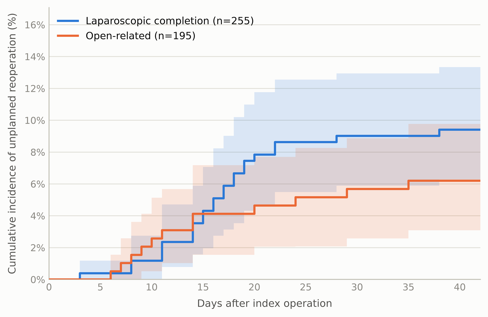
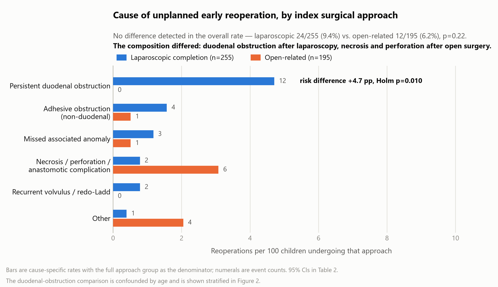

# Supplementary material

**Early Unplanned Reoperation After Laparoscopic Versus Open Ladd Procedure: Adjudicated Cause and Mechanism in 450 Children**

Jun Shu, Kai Zheng, Hongqiang Bian, Jun Yang, Xin Wang

---

**Supplementary Table S1.** Inter-rater agreement for the four-pass blinded adjudication.

| Adjudication pass | Item scored | n | Categories | Observed agreement | Cohen's κ (95% CI) | PABAK (95% CI) |
|---|---|---|---|---|---|---|
| **Pass 1** — outcome adjudication (masked operative narratives; reviewers blinded to index approach) | Cause of reoperation, scheme applied at the time of scoring | 52 | 6 | 92.3% (48/52) | 0.90 (0.80 to 0.99) | — |
| | Cause of reoperation, final six-category scheme† | 52 | 6 | 92.3% (48/52) | 0.90 (0.81 to 0.99) | — |
| | Associated anomaly identified at reoperation | 52 | 5 | 100.0% (52/52) | 1.00¶ | — |
| | Anomaly recognized before the index operation | 52 | 3 | 100.0% (52/52) | 1.00¶ | — |
| **Pass 2** — exposure and severity adjudication (complete index operative notes; reoperated children mixed with a random sample of non-reoperated children) | Index surgical approach§ | 132 | 4 | 90.2% (119/132) | 0.82 (0.73 to 0.91) | — |
| | Bowel necrosis at the index operation (yes/no)‡ | 132 | 2 | 93.9% (124/132) | 0.57 (0.29 to 0.86) | 0.88 (0.77 to 0.94) |
| | Bowel resection at the index operation (yes/no)‡ | 132 | 2 | 95.5% (126/132) | 0.23 (−0.38 to 0.83) | 0.91 (0.81 to 0.96) |
| **Pass 3** — mechanism of persistent duodenal obstruction (reoperation narratives with abdominal-access wording masked, case order randomized)‖ | Mechanism: technical deficiency / intrinsic lesion / postoperative adhesion / indeterminate | 12 | 2 | 100% (12/12) | 1.00¶ | — |
| **Pass 4** — eligibility adjudication (index operative note with abdominal-access wording masked, plus any preceding operations; all records after the index operation withheld) | Index operation was a primary Ladd procedure | 19 | 4 | 89.5% (17/19) | 0.84 (0.64 to 1.00) | — |
| **Validation** — automated text classifier vs. reviewer consensus | Index surgical approach | 132 | 4 | 90.9% (120/132) | 0.83 (0.74 to 0.92) | — |
| | Bowel necrosis at the index operation | 132 | 2 | 93.9% (124/132) | 0.57 (0.29 to 0.86) | 0.88 (0.77 to 0.94) |

Agreement was computed from each reviewer's own independent copy of the adjudication workbook, not from the merged consensus file. Pass 1 covers 52 of the 53 candidate reoperations submitted for adjudication; the remaining child, in whom neither reviewer assigned a cause, was later excluded as a late reoperation outside the 42-day window. Of the 52 scored records, 36 were ultimately included as unplanned reoperations (11 excluded as planned staged procedures, 1 more beyond the time window, 1 for unavailable records, and 3 in children whose index operation was judged in Pass 4 not to be a primary Ladd procedure); adding the unscored child gives the 2 beyond-window exclusions reported in Supplementary Table S3. Pass 2 covers a pool of 132 index operations; Pass 3 covers the 12 cohort children reoperated for persistent duodenal obstruction; Pass 4 covers the 19 children whose index record was questionable. Disagreements were resolved by consensus before analysis.

‖ In Pass 3 the reader also had no access to age, study number, or index approach. Diagnostic endoscopy wording was deliberately left unmasked, since it carries the operative findings and does not indicate whether the index operation was laparoscopic or open. Both readers read the same records, so concordance measures reproducibility rather than accuracy.

† The category *missed associated anomaly* was created after scoring. Membership is a deterministic function of two fields each reviewer had already scored independently under blinding (an associated anomaly other than “none”, together with that anomaly being unrecognized at the index operation), and agreement on both fields was perfect (κ=1.00). Applying that rule to each reviewer's own ratings therefore yields that reviewer's rating under the final taxonomy; no record was re-read. The 4 disagreements were identical under both schemes and all lay between adhesive obstruction and either persistent duodenal obstruction or necrosis/perforation.

‡ For these two rare binary items, κ is deflated by the low base rate (the kappa paradox): expected agreement was 0.858 for necrosis and 0.941 for resection, so κ is small despite observed agreement above 93%. The prevalence-adjusted bias-adjusted κ (PABAK = (k·Pₒ − 1)/(k − 1)) is reported alongside; its confidence interval is propagated from the Wilson interval for the observed agreement. Necrosis was scored positive by one reviewer only in 8/132 records and by both in 6/132; bowel resection was scored positive by either reviewer in 7/132 records but by both in only 1, which is why its κ is lower still.

§ Approach was recorded with the labels *laparoscopic completion*, *conversion to open*, and *open*; one reviewer additionally used *laparoscopically assisted* for a single record, resolved to laparoscopic completion by consensus. Collapsing that label gives κ=0.83 (0.74 to 0.92). Of the 12 disagreements, 9 lay on the single boundary between conversion and laparoscopic completion, the same boundary examined in the intention-to-treat sensitivity analysis (Table 4); the remaining 3 involved open versus laparoscopic completion. The automated classifier used to assign approach in the full cohort was validated against the reviewer consensus in this pool (final rows).

¶ Where the two reviewers agreed on every record — the two associated-anomaly fields (52/52 each) and mechanism (12/12) — κ = 1.00, but the normal-approximation standard error of κ is zero at perfect concordance, so its confidence interval degenerates to 1.00–1.00 and is not a statement of precision. The Wilson intervals for the observed agreements are 93.1–100%, 93.1–100%, 75.7–100% respectively. In the mechanism pass only two of the four categories were used (technical deficiency 3, postoperative adhesion 9); by definition this category contains no intrinsic lesion, and no case was scored indeterminate. Agreement was aided by the three technically deficient cases being documented in unusually explicit terms.

PABAK, prevalence-adjusted bias-adjusted kappa.

---

**Supplementary Table S2.** Keyword rules used for cohort eligibility and to assign index surgical approach and index bowel necrosis for all 450 children, applied to the recorded procedure name concatenated with the operative narrative and coded diagnosis. Records are in Chinese; the original strings are given verbatim with English glosses.

| Variable | Rule (applied in order) | Original strings |
|---|---|---|
| Index approach | 1. If any conversion term is present → **conversion to open** | 中转 (conversion) |
| | 2. Otherwise, if any laparoscopic term is present → **laparoscopic completion** | 腹腔镜 (laparoscopy), 腔镜 (endoscopic/laparoscopic), 镜下 (under scope), Trocar / trocar, 气腹 (pneumoperitoneum) |
| | 3. Otherwise → **open** | — |
| Index bowel necrosis | Term present **after** deleting explicit negations → **yes**; otherwise **no** | 坏死 (necrosis); negations removed first: 未见坏死, 无坏死, 未见明显坏死, 未坏死, 无明显坏死 |
| Cohort eligibility (§2.2) | Any term present in the procedure name or coded diagnosis → candidate for adjudication | 拉德 / Ladd, 扭转复位 (derotation), 肠旋转 (intestinal rotation), 中肠 (midgut), 旋转不良 (malrotation) |

Agreement of the approach and necrosis rules with blinded reviewer consensus in the 132-child validation pool is given in Supplementary Table S1 (approach κ=0.83; necrosis κ=0.57 with observed agreement 93.9%). Because reviewers were blinded to outcome when adjudicating exposure, residual misclassification is expected to be non-differential and to bias the approach comparison toward the null.

---

**Supplementary Table S3.** Timing of unplanned reoperation (n=36).

| Characteristic | Value |
|---|---|
| Unplanned reoperations | 36 / 450 (8.0%) |
| Interval, days, median (IQR) | 14.5 (10–19) |
| Interval range, days | 2–37 |
| Postoperative days 8–21, n (%) | 24 (67) |
| Binned interval 0–7 / 8–14 / 15–21 / 22–30 / >30 d, n | 5 / 13 / 11 / 5 / 2 |

Candidate reoperations adjudicated: 53. Excluded: planned staged procedure 11 (4 of them in children outside the cohort), beyond time window 2, records unavailable 1, and 3 in children whose index operation was judged not to be a primary Ladd procedure (§2.4).

*Follow-up completeness for the 42-day window (n=450).* 396 children (88.0%) completed the window without either the outcome or the competing event; 36 (8.0%) had the primary outcome (Table 2); 16 (3.6%) had the competing event (confirmed death) within the window, at a median of 1 day (Table 3 footnote); 2 children (0.4%) discharged against medical advice could not be traced by telephone and were censored at their last recorded discharge, 5 and 18 days after the index operation (§2.3).

---

**Supplementary Table S4.** Full four-pass blinded adjudication protocol.

Adjudication was performed in four independent passes designed to keep eligibility, exposure, outcome, and mechanism apart. Agreement for every adjudicated item is given in Supplementary Table S1.

| Pass | What was adjudicated | Masking | Material read | Agreement |
|---|---|---|---|---|
| 1 | Cause of reoperation (six categories) and presence of an associated anomaly | All approach-identifying wording masked; reviewers blinded to whether the index operation had been laparoscopic or open | Reoperation operative narratives | Cause κ=0.90 (95% CI 0.81–0.99; observed agreement 92.3%); associated-anomaly and prior-diagnosis fields κ=1.00 |
| 2 | Index approach and index severity | Reviewers did not know who had been reoperated | Complete index operative notes for a pool of 132 children: the 38 reoperations adjudicated at that time, mixed with 94 non-reoperated children drawn at random (22% of 427) | Index approach κ=0.82; index necrosis observed agreement 93.9% (PABAK 0.88); bowel resection 95.5% (PABAK 0.91) |
| 3 | Mechanism of each persistent duodenal obstruction (technical deficiency / intrinsic lesion / postoperative periduodenal adhesion / indeterminate) | All abdominal-access wording masked; case order randomized; no access to age, study number, or index approach | Reoperation narratives of the 12 duodenal cases | Agreement on all 12 cases (100%; Wilson 95% CI 75.7–100%; κ=1.00) |
| 4 | Whether the index operation was a primary Ladd procedure | Records *after* the index operation withheld, so reoperation status could not influence eligibility | Index operative note (abdominal-access wording masked) plus any preceding operations, for 19 children with a questionable index record | κ=0.844 (95% CI 0.640–1.00; observed agreement 89.5%); the two disagreements resolved by consensus |

*Second pass.* This pass validated the keyword rules of §2.3, which assigned exposure for the remaining children. Disagreements were resolved by consensus. Agreement was quantified with Cohen's κ and, for rare binary outcomes, prevalence-adjusted bias-adjusted κ (PABAK) [16].

*Derivation of the* missed associated anomaly *category.* This category was separated out from *persistent duodenal obstruction* after adjudication. No record was re-read: membership is a deterministic function of two fields each reviewer had already scored independently under blinding (an associated anomaly other than "none", plus that anomaly having been unrecognized at the index operation), and agreement on both was perfect (κ=1.00). Applying that rule to each reviewer's own ratings gives their rating under the final taxonomy; agreement on cause was κ=0.90, unchanged from the scheme used at scoring, and the four disagreements were identical under both.

*Fourth-pass outcome.* Sixteen children were judged not to have had a primary Ladd operation by unanimous first-read agreement — four because the index record was a diagnostic endoscopy or biopsy, eight because the index operation was a redo Ladd for recurrent malrotation, and four because a previous Ladd had been performed and the index operation was not itself a Ladd. Two further children, on whom the reviewers initially disagreed, were excluded by consensus; both were resolved to the redo-Ladd category, bringing that category's total to ten (Supplementary Table S1). Separately, in three children whose earliest recorded operation was a preliminary procedure on the same admission (not itself a candidate for this pass), the index date was corrected to the nearby operation that was unambiguously the primary Ladd; only one of these three was also among the 19 children reviewed in this pass, and that child was excluded (redo-Ladd category) rather than retained. Three of the 39 reoperations initially identified were in children excluded by this pass, all aged over one year.

*Record retrieval.* Records for four children were absent from the research extract (three reoperations and one index operation); they were retrieved from the medical-records department and re-entered before analysis. In that one child the missing index note showed conversion to open, which would otherwise have been misclassified.

---

**Supplementary Table S5.** Secondary and sensitivity analyses, taxonomy check, and full limitations.

### S5a. Secondary and sensitivity analyses

All are reported in Table 4 of the main text unless noted.

| Analysis | Purpose | Result |
|---|---|---|
| Mantel–Haenszel pooling across age bands | Stratum-adjusted overall rate | OR 1.54 (0.74–3.24) |
| Intention-to-treat regrouping (conversions with laparoscopic arm) | A surgeon cannot know in advance which child will require conversion [13] | OR 2.45 (0.97–7.4), p=0.060 |
| Consensus-adjudicated subsample (n=124) | Exposure misclassification | OR 2.03 (0.84–5.17) |
| Era comparison within the laparoscopic arm (≤2017 vs. >2017) | Learning curve | 10.0% vs. 8.8%, p=0.832 |
| Firth + index year | Approach was associated with calendar period | OR 1.49 (0.73–3.06) |
| Counting planned staged reoperations as outcomes | Outcome definition | OR 1.48 (0.74–3.1) |
| Reverting the fourth-pass eligibility exclusions (n=468) | Cohort definition | OR 1.47 (0.71–3.2) |
| Gray's test within neonates | Competing risks | χ²=7.01, p=0.008 |
| E-value for the neonatal association | Unmeasured confounding | 2.10 (for the exact lower bound of 1.38) |

Cause-specific Cox regression was fitted censoring at the competing event, with the proportional-hazards assumption checked by scaled Schoenfeld residuals (p=0.15). Firth p values are from the penalized likelihood-ratio test, obtained by constraining the coefficient of interest to zero within the full design matrix, keeping the Jeffreys penalty at the same dimension in both models. Cumulative incidence used 1000-resample bootstrap bands with administrative censoring at 42 days, matching the outcome window.

### S5b. Taxonomy check against coded intrinsic duodenal anomalies

As a check on the taxonomy, we asked whether a coded intrinsic duodenal anomaly predicted category-1 obstruction. We could not detect such a relation, but the comparison is uninformative: 1 of 20 such children had a category-1 reoperation (5.0%) versus 11/430 (2.6%) of the rest (OR 2.00, 95% CI 0.04–15.2, p=0.42), a point estimate above unity resting on a single event. It is consistent with the intended separation but does not establish it. Three of the four missed-anomaly reoperations occurred in children with an intrinsic duodenal anomaly somewhere in their record, but anomaly coding draws on text from all admissions including the reoperation, so that association cannot be interpreted.

### S5c. Postoperative contrast studies in the 12 duodenal reoperations

Every imaging study performed between the index operation and the reoperation was retrieved from the radiology record (`imaging_validation.py`). All 12 children had imaging in that interval (31 studies after de-duplication: 19 plain radiographs, 11 ultrasound examinations, 1 computed tomogram). Eleven water-soluble contrast studies were performed, covering 8 of the 12 children — all 3 with a technically deficient index operation and 5 of the 9 with an adhesion mechanism.

Each report was classified by whether it described impaired duodenal transit, using the explicit statement about contrast passage rather than the presence of morphological words, because "扩张" (dilated) appears both in positive statements and inside the negation "未见梗阻及扩张" (no obstruction or dilatation), and "显示不清" (poorly demonstrated) refers to image quality rather than obstruction.

| Mechanism | Last contrast study | Report | Days before reoperation |
|---|---|---|---|
| Technical deficiency | POD 7 | no impaired transit | 10 |
| Technical deficiency | POD 15 | no impaired transit | 3 |
| Technical deficiency | POD 10 | impaired transit | 12 |
| Adhesion | POD 12 | impaired transit | 2 |
| Adhesion | POD 14 | impaired transit | 1 |
| Adhesion | POD 6 | impaired transit | 10 |
| Adhesion | POD 7 | duodenum not described | 12 |
| Adhesion | POD 18 | morphology abnormal, transit preserved | 2 |

Two of the three technically deficient operations were preceded by a contrast study reporting normal duodenal transit; in one, three days before an operation that found membranous bands still covering the descending and horizontal duodenum. Contrast appearance did not separate the two mechanisms (impaired transit reported in 1/3 technical and 3/5 adhesion cases; Fisher p=1.00), and the spiral and coil-spring signs were seen in both. With eight evaluable studies these are case-series observations, not estimates of sensitivity or of a between-mechanism difference.

**Interval to reoperation did not separate the mechanisms either.** Median 18 days (17–22) after a technically deficient operation versus 15 days (10–20) after an adhesion mechanism (p=0.095), but that difference is confounded by age: all three technical cases were neonates. Restricted to neonates the two are indistinguishable (18 vs. 19 days, p=1.00). The interval instead separates the two *age* clusters: 14 days (10–15) in children aged ≥1 year versus 18.5 days in neonates (p=0.005).

Taken together, neither imaging appearance nor timing provides an external check on the mechanism classification, which therefore continues to rest on the operative record alone (S5d, *Measurement*).

### S5d. Full limitations

*Ascertainment.* This is a single-center retrospective study spanning 13.5 years; a child reoperated elsewhere, or managed non-operatively for the same problem, would not be captured, so 8.0% is the reoperated fraction rather than the complication rate. Children discharged against medical advice, in whom reoperation elsewhere would be most likely, were traced by telephone; 22 of 24 were accounted for and none had been operated elsewhere. The 2 who could not be contacted were both open-related neonates; counting them as unobserved duodenal reoperations — the most adverse assumption — would move the neonatal comparison to 6/142 versus 2/163 (p=0.15).

*The post hoc stratification.* The age stratification that shapes our conclusions was not prespecified; it was prompted by the bimodal age distribution of the duodenal-obstruction cases. Although the blinded mechanism data corroborate it independently of any subgroup test, it remains a post hoc division requiring confirmation in an independent cohort. The age cut-points were themselves data-driven and are covered by no multiplicity correction. We did not test the approach-by-age interaction formally: with no open-related event in any stratum the model is unidentifiable, so the difference between strata rests on separate tests, and a significant neonatal result alongside a null one beyond infancy is not itself evidence that the effect differs by age.

*Sparse events and separation.* The neonatal comparison rests on six events against a zero cell, so its lower confidence bound (1.38) is informative but its upper bound is not, and it is not robust to a single unobserved competing event: had one of the 16 open-related neonates who died reached a duodenal reoperation, p would move from 0.010 to 0.053. The expected number of such unobserved events is 0.68. The ≥1-year estimate is correspondingly imprecise, and the overall-rate comparison was underpowered (19% power for an odds ratio of 1.5, 51% for 2.0, against the observed open-related rate of 6.2%).

*Measurement.* Cause assignment used a single-choice scheme, and mixed presentations were forced to a dominant category by the prespecified priority rule. The mechanistic re-review was double-read under blinding with complete agreement, but both readers read the same records, so concordance measures reproducibility rather than accuracy: the distinction between a step left undone and adhesion around a correctly performed repair rests on what the surgeon chose to record, and a deficiency already corrected, or not remarked upon, would be missed by both readers. Agreement was also less demanding than it appears, since all three technically deficient cases were documented in unusually explicit terms. Operative narratives may carry inadvertent cues to approach despite masking. For the two rare binary severity items, positive agreement was modest (bowel resection: of seven records called positive by either reviewer, only one by both; Supplementary Table S1), so index necrosis, used as a covariate, carries measurement error that propagates into the adjusted estimates.

*Exposure.* Exposure was assigned by keyword rule and validated against blinded reviewer consensus in a 132-child subsample (κ=0.82); for the remainder it was not independently reviewed, though the rule and the reviewers agreed on 120 of 132 in that subsample and restricting the analysis to it changed nothing. Within the consensus-adjudicated subsample the keyword rule and the reviewer consensus disagreed on 5 of 124 children (4.0%). The intention-to-treat analysis is the one most sensitive to exposure misclassification, since most reviewer disagreements about approach lay on the very boundary it moves.

*Cohort and outcome definitions.* Planned staged reoperations were excluded by design; counting them as outcomes left the comparison null. Eighteen children whose index record proved not to be a primary Ladd procedure were excluded by blinded adjudication rather than as a sensitivity analysis alone; three had been reoperated, which is why the cohort and event count differ from the earliest-operation rule. The 42-day window is arbitrary: adhesive obstruction presenting later was not counted, so 8.5% after laparoscopy beyond one year is a lower bound, and the design cannot address recurrent volvulus, the outcome on which the comparative literature has focused, of which we saw two cases.

*Residual confounding and other.* Indication and urgency were not recorded separately, and index necrosis is only a partial proxy for them, so confounding by severity persists within strata. Associated-anomaly ascertainment was indeterminate for 6/450 (1.3%), and because anomaly coding draws on text from every admission including the reoperation, it records anomalies ever documented rather than anomalies known preoperatively. Reoperations may cluster by operating surgeon; we did not model surgeon-level clustering. Finally, two-thirds of this cohort presented as neonates, so the balance of causes may differ where malrotation more often presents beyond infancy.

---

**Supplementary Figure S1.** Competing-risk cumulative incidence of unplanned reoperation by index surgical approach, estimated with the Aalen–Johansen method treating confirmed death as the competing event, with administrative censoring at 42 days, matching the outcome window. Shaded areas are 95% bootstrap confidence bands (1000 resamples). Forty-two-day cumulative incidence was 9.4% after laparoscopic completion (n=255) versus 6.2% after open-related surgery (n=195); the corresponding cause-specific Cox hazard ratio was 1.41 (95% CI 0.71–2.82, p=0.331). The competing event itself was far more frequent in the open-related arm (all 16 deaths within the window followed open-related surgery, so the hazard ratio is not estimable), which is why the competing-risk framework was used rather than a naive Kaplan–Meier complement. *(File: FigureS1_CIF_reoperation_EN.png / .pdf)*

<!--pagebreak-->

**Supplementary Figure S1**

---

**Supplementary Figure S2.** Cause-specific rate of unplanned early reoperation by index surgical approach. Bars are cause-specific rates using the whole approach group as the denominator (255 laparoscopic, 195 open-related); numerals are event counts. No difference was detected in the overall reoperation rate between approaches (9.4% vs. 6.2%, p=0.22), but the composition differed: persistent duodenal obstruction followed only laparoscopic completions (4.7% vs. 0%; risk difference +4.7 percentage points, 95% CI 1.9 to 8.0, Holm p=0.010), whereas necrosis, perforation, or anastomotic complication and “other” complications predominated after open-related surgery. Confidence intervals are given in Table 2; the duodenal-obstruction comparison is shown stratified by age in Figure 2.

<!--pagebreak-->

**Supplementary Figure S2**

